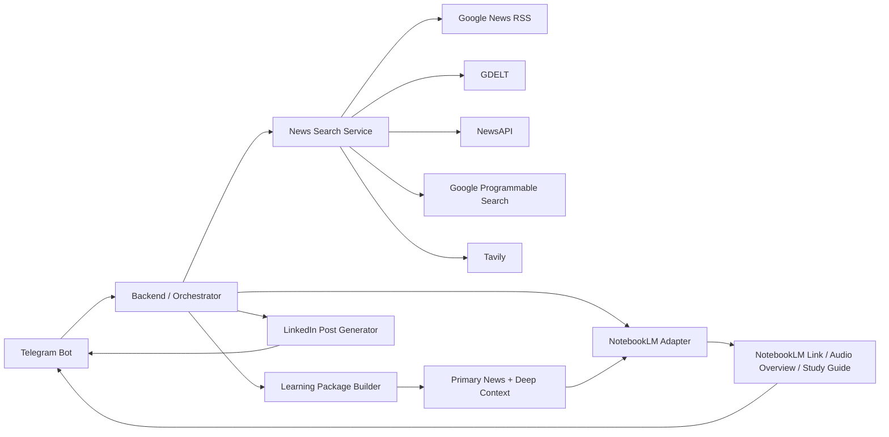
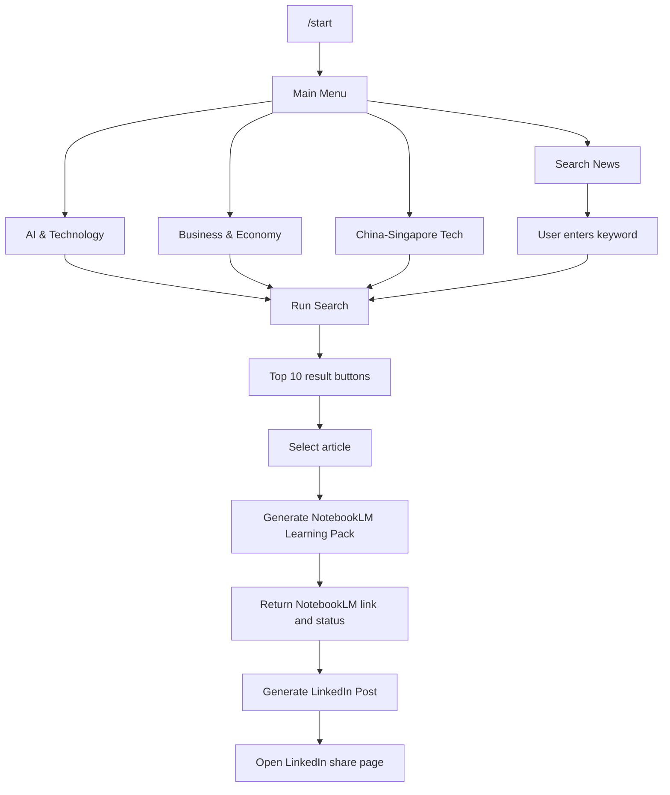

# Architecture

The system is English-first by default and uses Telegram buttons as the main interaction surface.

## Telegram Button Flow

## Search Coverage

The search layer intentionally combines several sources:

- Google News RSS for timely headline discovery.
- GDELT for broad global news coverage without an API key.
- NewsAPI for structured news search when an API key is available.
- Google Programmable Search for high-traffic web articles and domain-targeted search.
- Tavily for AI-friendly deep context and long-form article discovery.

The ranking layer scores results by relevance, freshness, source authority, article type, depth, and traffic proxy.

## Personalized Ranking

The default search window is 7 days. Results are additionally weighted toward the user's background: AI, technology deployment, governance, Singapore public-sector technology, China-Singapore collaboration, ASEAN relevance, semiconductors, cloud, data centers, and enterprise adoption.

## NotebookLM Automation

NotebookLM is handled through a dedicated adapter using `notebooklm-py[browser]`:

- Prepare the selected news title, summary, learner context, and original URL.
- Add the selected-news learning guide as a text source.
- Try to add the original publisher URL, but ignore failures caused by paywalls or parser restrictions.
- Run NotebookLM Web Fast Research and import fewer than 20 high-signal sources discovered by NotebookLM.
- Target a 15-minute Deep Dive podcast.
- Generate a shorter Audio Brief for quick listening.
- Generate the Deep Dive podcast, Audio Brief, and portrait/concise infographic in parallel.
- Download all completed NotebookLM media artifacts and return them to Telegram.
- Use a stored Google/NotebookLM `storage_state.json` session on the server.

The adapter keeps NotebookLM isolated from Telegram and search logic, so the connector can be replaced if Google later releases an official API.
